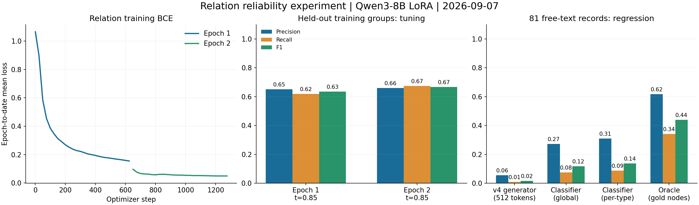
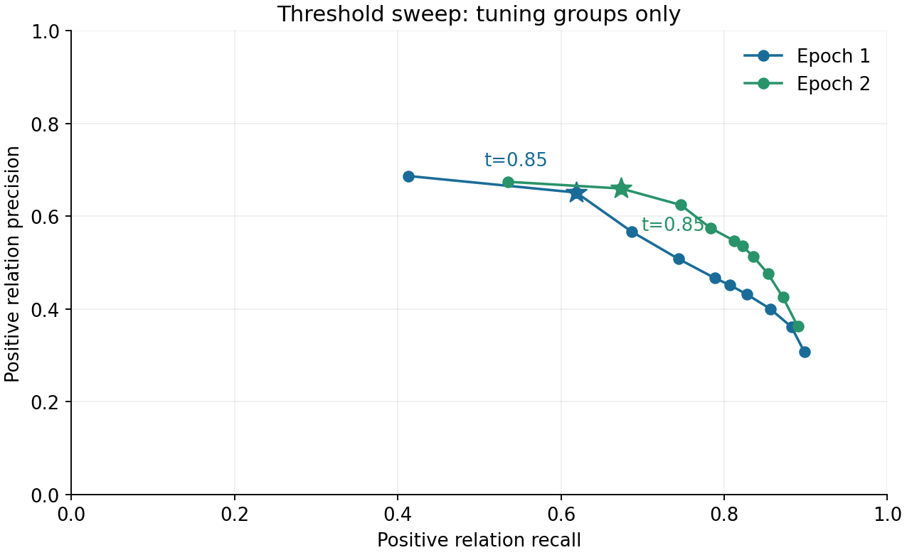

# 本轮结果：有提升，仍不能直接上线

2026-09-07，远程 A100 80GB 完成 Qwen3-8B relation LoRA 分类头训练：2 epochs、1,282 optimizer steps、42.0 分钟。保留原 entity v4；没有覆盖旧模型或修改主分支。

## 1. 架构改动

结构化 ICD 仍由 Python 解析；自由文本仍走 **实体模型 → 原文对齐/编号 → relation → 校验/JSON 组装**。只把 relation 换成非生成式多标签分类头，每次看一个有序实体对的名称、类型和短原文。模型不再生成 relation JSON、实体编号或证据文字。

## 2. 训练图与参数

训练数据 10,246 对；内部 tuning 5,714 对；按原训练来源组再划分 545/61 组，不用历史 dev 选阈值。LoRA r=8/alpha=16，lr=5e-5，batch=4×累积4，输入上限768 tokens，positive weight=2，seed=42。没有因输入超长丢弃 train/tune/本轮全量候选。

| 内部验证 | Train BCE | Precision | Recall | F1 | F0.5 |
|---|---:|---:|---:|---:|---:|
| Epoch 1，阈值0.85 | 0.153565 | 65.11% | 61.88% | 63.45% | 64.44% |
| Epoch 2，阈值0.85 | 0.049294 | 65.98% | 67.36% | 66.67% | 66.26% |
| Epoch 2，分类别阈值 | 同一模型 | 82.13% | 56.40% | 66.87% | 75.26% |

选中 epoch 2。分类别策略也仅拟合 tuning：有足够支持的关系要求 P≥0.7；样本少的保留全局阈值。`has_diagnostic_criterion` 和 `supports_Diagnostic Criterion_of` 没有合格阈值，设置为拒绝输出；**这是牺牲这两类召回，不是它们被修好了**。

以上是已覆盖候选对上的验证分数，不包含所有原始漏掉的实体/关系。BCE 与旧模型的 JSON-token CE 不可直接比较。

## 3. 主结果：固定同一批旧实体，严格关系匹配

148 条历史 dev 全部参与，主要看其中 81 条自由文本；不是只选好看的样例。

| Relation 方案 | TP/FP/FN | Precision | Recall | F1 |
|---|---|---:|---:|---:|
| 旧 v4 生成式，输出上限512 | 6 / 103 / 632 | 5.50% | 0.94% | 1.61% |
| 新分类头，全局阈值 | 48 / 128 / 590 | 27.27% | 7.52% | 11.79% |
| 新分类头，分类别阈值 | 56 / 125 / 582 | 30.94% | 8.78% | 13.68% |
| Gold 实体 + 新分类头，全局阈值（仅诊断） | 218 / 135 / 420 | 61.76% | 34.17% | 44.00% |

**提升是真的，但绝对准确度仍很低。** 新分类别模式仍有125条银标不匹配，比旧结果103条还多；正确边从6条增加到56条，所以 precision/F1 提升。不能宣称“所有误报数量都下降”，也不能把银标不匹配全部叫医学幻觉。

67 条 ICD 的结果保持不变：relation F1=88.52%。混合148条的 relation F1：旧13.81%，新全局21.79%，新分类别23.38%。实体输出固定，因此自由文本 entity F1 仍46.38%。

补充：新增类型保护规则能再移除全局模式7条FP、分类别模式10条FP，未移除TP；分类别+规则的 P/R/F1=32.75%/8.78%/13.84%。此规则在检查本轮错误后补充，属于事后回归修复，不纳入上表主结果。只约束已核实的 `is_core_symptom_of`/`is_associated_symptom_of` 为 Symptom→Disease，不扩展为任意目标类型猜测。

## 4. 改善样例与失败样例

### 旧16000-token问题样例：受控复测

固定它原来的15个实体、同一原文，只替换 relation：

| sample_index=2 | TP | FP | FN |
|---|---:|---:|---:|
| 旧生成式16000 tokens | 0 | 32 | 12 |
| 新分类头，全局阈值0.85 | 6 | 0 | 6 |

旧的症状互连和错误疾病绑定没有再输出；仍漏掉一半银标关系。旧16000三条实验与旧512全量实验的 entity 输出并不完全相同，因此专门重跑了这个“同实体”对照，没有混用两个缓存。

### 全量回归集中的代表情况

- **index=3，全局模式：7 TP、1 FP、8 FN。** 找回低体重、肌张力低下、代谢问题等到主疾病的关系。剩余一条严格FP是症状名称多了 `, etc.`，并非错误疾病绑定。
- **index=58，分类别模式：6 TP、0 FP、3 FN。** 是另一个有效改善样例，仍有漏报。
- **index=73，全局模式：0 TP、37 FP、24 FN。** 银标写 `Generalised anxiety disorder`，实体模型写 `Generalized Anxiety Disorder`；还把同一个疾病名字标成了 Symptom，出现错误类型的目标；症状粒度也不一致。不能把37条全部归因为关系语义幻觉。分类别阈值在此样例反而输出42条不匹配，说明内部验证上的高精度不能保证每条输入更好。
- **index=41，全局模式：0 TP、9 FP、11 FN。** 疾病名多一个逗号；银标把部分症状合为一项，模型拆开。严格端点键不匹配，整条边被判错。这是标注、实体输出与评测契约没有统一。

完整原文、gold、新旧 JSON、逐边FP/FN均保存于私有实验归档，未提交公开仓库。

### 必须保留的失败测试

8 个合成关系测试全部输出 NONE：四个无关系题正确，四个正例全部漏掉，正关系 F1=0。甚至明确的 `Fatigue is a core symptom of Condition A`，core 分数只有0.252，associated 分数0.534；多关系正例也漏掉。不能把4/8的表面正确率当成功，说明匿名名称/不同表达的泛化及关系类型区分仍差。

真实全流程另做冒烟：一条真实输入得到3个实体、6个候选对、1条关系，两个真实模型均被调用；另外ICD合成输入正常，匿名疾病合成输入漏掉疾病实体。冒烟仅证明链路可运行，**不等于把新版实体切句/提示词在148条上全量重跑过**；主表是固定实体的 relation 模块对照。

## 5. 当前瓶颈与评测解释

- 按严格名称/类型匹配，638条自由文本gold关系中，旧实体结果的双端点只支持120条；局部候选再降到106条。即便 relation 全判对，当前候选召回上限也只有16.61%。
- 分类别模式的582条FN：518条端点无法匹配（包含真实实体漏检和命名/粒度不一致）、14条无局部候选、50条分类决策漏掉。现在只继续调 relation，无法解决主要召回瓶颈。
- 125条FP中105条涉及不在gold概念集合的端点，13条同端点关系类型不同，7条pair未标注。需要人工审定哪些是错误、哪些是银标缺失，不宜直接把这些都当 hard negative。
- 仅做标点和少量英美拼写归一，分类别模式可多匹配22条边，F1从13.68%变为19.05%。这是看过问题后做的**口径诊断**，没有替换严格主分数，也不是新模型增益；实体合并/拆分仍未处理。
- 另发现原文损坏仍在：训练70条、dev8条含 `pregnullcy`、`finullces` 等错误。仓库v2已有修复字典，但实际远程训练链没有用上。本轮模型使用的仍是冻结的这份数据，没有把它称为“完全清洗后训练”。
- Gold是教师银标，历史dev多次被查看；本轮只有一个训练seed。结果不能当作独立盲测或临床准确度。源组bootstrap的分类别F1增量区间约+5.64～+18.38个百分点，仅描述抽样波动，不能消除银标错误或测试复用偏差。

Precision是预测边匹配银标的比例；Recall是找回gold边的比例；F1综合两者，F0.5更重precision。证据指标要求“同一条边+证据文本匹配”，但文本来自原文并不保证语义蕴含。无效输出计FN，错误端点计FP，NONE不计正类F1。

## 6. 下一轮计划：先数据与实体契约，不堆架构

1. **先统一数据契约。** 原文错字按现有已审核字典修复，保留变更清单；用ICD/source元数据建立主疾病及明确别名映射，统一英美拼写、标点、症状拆分/合并标准。不可用模糊字符串相似度随意合并不同疾病/严重度。
2. **人工复核分层关系集。** 覆盖主疾病绑定、否定、并列/父子、反向、多关系、长距离指代和银标未标注边；固定一份未参与开发的新测试集。本轮FP不能未经核实就全部转成负例。
3. **在相同架构内重训 entity，再训 relation。** Entity 改用修复后的短span与统一实体粒度；训练内部做来源组 out-of-fold 实体预测，用真实上游错误训练 relation，而不是只给完美gold实体。
4. **做小规模单变量实验。** 先固定数据比较 relation lr=2e-5/5e-5、负例1:1/1:2、上下文距离2/4；先看候选覆盖与验证F1/P/R，再决定全训。保留多标签头，补足目前只有2个多标签训练pair的问题。阈值只能用内部验证确定。
5. **规则保持少而透明。** 只做有依据的类型约束、已知并列错误和证据一致性保护，记录每条拒绝原因及误杀。跨句关系通过主疾病元数据/有限上下文解决，不靠继续拉长输出。
6. **暂不上PPO/DPO。** 当前分类头优先改监督和负例；生成式DPO并不能直接套到这个头。若未来重新评估生成式支路，且有审定偏好对，再做独立DPO对照。现阶段RL会把不稳定银标固化成奖励。

代码、训练曲线、每类指标、配置、数据/预测哈希见本目录 [metrics.json](metrics.json) 与 [training_history.json](training_history.json)。当前本地/远程代码一致并保留训练启动时快照；公开仓库不含训练原文、原始生成、权重或连接凭据。
